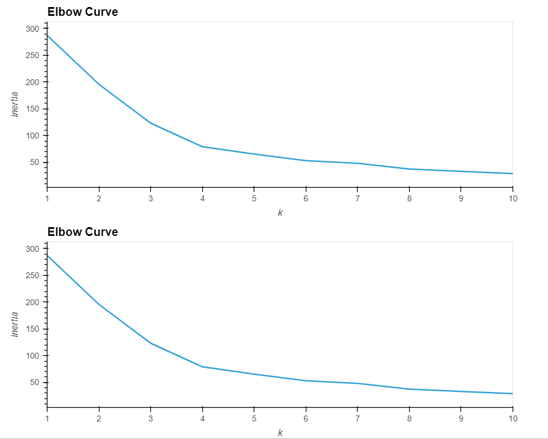
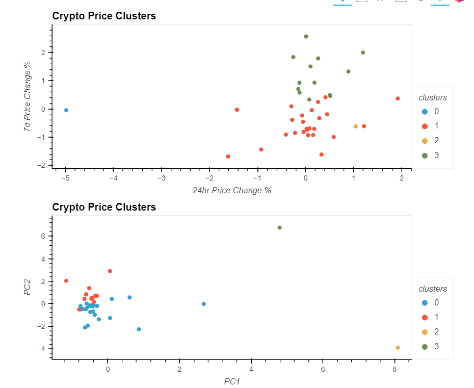

# Challenge 10 Crypto Investments

## Introduction
In this project we will be using K-Means, Principal Component Analysis, and the Elbow Method to analyze Crypto Currency data.

## Data
Elbow Method:

Clusters:

